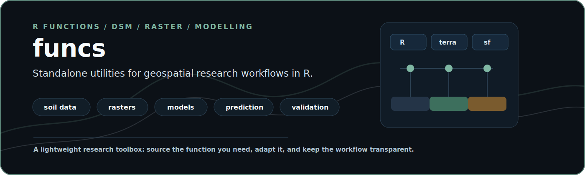

<p align="center">
  
</p>

<h1 align="center">funcs</h1>

<p align="center">
  <strong>A practical R toolbox for digital soil mapping, raster processing, environmental covariates, machine learning, and spatial prediction.</strong>
</p>

<p align="center">
  
  
  
  
</p>

<p align="center">
  
  
  
</p>

<p align="center">
  <a href="#what-this-is">What This Is</a> |
  <a href="#highlights">Highlights</a> |
  <a href="#quick-start">Quick Start</a> |
  <a href="#function-map">Function Map</a> |
  <a href="#citation">Citation</a>
</p>

## What This Is

`funcs` is a personal, research-oriented collection of R functions and workflow
scripts developed by Cassio Marques Moquedace to support reproducible work in
soil science, digital soil mapping, environmental modelling, raster processing,
machine learning, model evaluation, and spatial prediction.

This repository is intentionally lightweight: functions are kept as standalone
`.R` files that can be sourced directly into analysis projects. It is not
currently structured as a formal R package.

## Highlights

<table>
  <tr>
    <td width="25%"><strong>Soil data diagnosis</strong><br>Evaluate completeness, bottlenecks, depth coverage, and attribute trade-offs in harmonized soil databases.</td>
    <td width="25%"><strong>Raster operations</strong><br>Crop, mask, project, tile, resample, write classified rasters, and prepare large spatial domains.</td>
    <td width="25%"><strong>Model workflows</strong><br>Regression and classification templates with repeated runs, LOOCV, grouped validation, RFE, and custom metrics.</td>
    <td width="25%"><strong>Spatial prediction</strong><br>Utilities for quantile random forest prediction, probability rasters, uncertainty outputs, and model diagnostics.</td>
  </tr>
</table>

## Quick Start

Source only the function you need:

```r
source("https://raw.githubusercontent.com/moquedace/funcs/main/soil_attr_balance.R")

res <- soil_attr_balance(
  data = soil_data,
  attrs = soil_attributes,
  unit_cols = "coord_id",
  depth_cols = c("upper_depth_cm", "lower_depth_cm"),
  required_attrs = "c_gkg",
  target_attrs = "c_gkg",
  min_pct = 0.50,
  ranking_metric = "weighted_score",
  return_selected = TRUE
)
```

For balanced raster processing:

```r
source("https://raw.githubusercontent.com/moquedace/funcs/main/balanced_raster_tiles.R")

tile_result <- balanced_raster_tiles(
  base_raster = terra::rast("path/to/base_raster.tif"),
  n_tile_rows = 10,
  n_tile_cols = 10,
  output_dir = "output/balanced_tiles",
  diagnostic_plots = TRUE
)
```

## Function Map

| Area | Main files |
| --- | --- |
| Soil database diagnostics | `soil_attr_balance.R`, `soil_attr_balance_documentation.md`, `soil_attr_balance_examples.md` |
| Balanced raster tiling | `balanced_raster_tiles.R`, `balanced_raster_tiles_documentation.md`, `balanced_raster_tiles_examples.md`, `check_tiles.R` |
| Raster processing | `crop_mask_project.R`, `standardize_crop_mask_raster.R`, `change_resolution.R`, `focal_resample.R`, `tile_raster.R`, `tile_raster_path.R`, `writeRaster_factor.R`, `rst_class_by_value.R` |
| Environmental covariates | `soilgrids_raster.R`, `download_febr_soildata.R`, `process_landsat_indices.R`, `calc_index_sentinel.R`, `morphometry_saga.R` |
| Regression modelling | `regression_modeling_single_run.R`, `regression_modeling_repeated_runs.R`, `regression_modeling_loocv.R`, `regression_modeling_leave_one_group_out.R` |
| Classification modelling | `classification_modeling_single_run.R`, `classification_modeling_repeated_runs.R`, `classification_modeling_loocv.R`, `classification_modeling_leave_one_group_out.R` |
| Prediction writers | `predict_qrf_raster.R`, `pred_writer_qrf_raster.R`, `pred_writer_raster_prob_raw.R`, `pred_writer_raster_prob_raw_resample.R` |
| Model evaluation | `pst_res_mqi.R`, `pst_res_class.R`, `pst_res_class_multiclass.R`, `calcular_metricas_raster.R`, `partial_dependence.R`, `aoa_meyer.R`, `explain_future.R` |
| Data preparation | `remove_outliers.R`, `points_to_class.R`, `spl.R`, `bivariate_map.R`, `app_vect.R` |
| Utilities | `install_load_pkg.R`, `copy_with_robocopy.R`, `gcs_download.R`, `gcs_upload.R`, `gbm_custom.R`, `caret_rfe_functions.R` |

## Recommended Use

1. Read the relevant `.md` documentation when available.
2. Source the specific `.R` file needed for your workflow.
3. Keep project-specific paths, input data, and output folders in your own
   analysis repository.
4. Check package dependencies inside each function or workflow before running.

## Repository Philosophy

This repository favors practical reuse over package ceremony. Many routines were
created inside research projects and later generalized when they became useful
across multiple workflows.

The main design goal is to make recurring geospatial and modelling tasks easier
to inspect, adapt, and reuse.

## Citation

If this repository supports your work, cite it as:

```text
Moquedace, C. M. (2026). funcs: R functions and computational routines for
digital soil mapping, raster processing, environmental modelling, and spatial
prediction. GitHub repository. https://github.com/moquedace/funcs
```

Machine-readable citation metadata is available in [`CITATION.cff`](CITATION.cff).

## License

This repository is made available under the MIT License. See [`LICENSE`](LICENSE).
